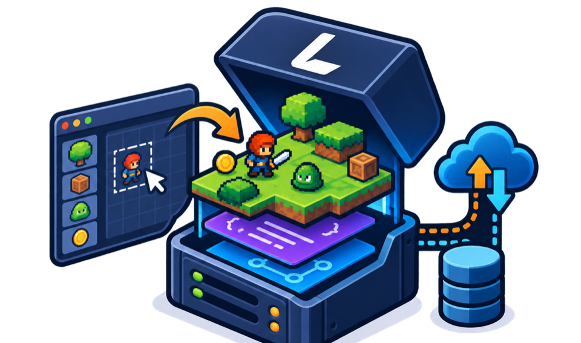

<p align="center">
  
</p>

<p align="center">
  <picture>
    <source media="(prefers-color-scheme: dark)" srcset="assets/brand/logo-horizontal-dark.png">
    
  </picture>
</p>

<p align="center">
  <strong>An open-source backend engine for 2D games.</strong><br>
  Author your maps, entities and behaviours as data in a web editor; your game fetches them at
  runtime and builds the level from them. Ship a balance change without shipping a build.
</p>

<p align="center">
  <a href="https://github.com/miladnalbandi/ludus-engine/actions/workflows/ci.yml"></a>
  <a href="LICENSE"></a>
  <a href="https://github.com/miladnalbandi/ludus-engine/issues/18"></a>
</p>

> **Status: early.** `v0.1.0` adds identity to the foundation — sign in, roles, API keys for
> game clients, and the project boundary. There is still **no content API**; that arrives in
> `v0.2.0`. The roadmap below is honest about what does and does not exist yet.

## What it is, and what it is not

Ludus is the **backend** for a 2D game. It owns the content your game reads and the player
state your game writes: levels and maps, entity definitions, behaviour parameters, and later
XP, items, currency, inventory and notifications. It gives you a web editor to author all of
that, and an HTTP API your game client reads it from.

Ludus is **not** a game engine. It does not render, simulate physics, or run your game loop.
Your engine does that. Ludus tells it what to build.

## Quickstart

```bash
git clone https://github.com/miladnalbandi/ludus-engine.git
cd ludus-engine
cp deploy/.env.example deploy/.env
# Set LUDUS_JWT_SECRET (openssl rand -base64 48) and the two LUDUS_ADMIN_* values.
# The engine refuses to start without a signing secret, deliberately.
docker compose -f deploy/docker-compose.yml up
```

Then open:

| | |
|---|---|
| API documentation | http://localhost:8080/docs |
| OpenAPI document | http://localhost:8080/api-docs |
| Health | http://localhost:8080/actuator/health |

To build and test from source you need JDK 21 and Docker:

```bash
./mvnw verify
```

## Architecture

```
        ┌────────────────┐        authoring        ┌──────────────────┐
        │     editor     │ ──────────────────────▶ │                  │
        │   (web, TS)    │                         │   Ludus engine   │
        └────────────────┘                         │  (Java, Spring)  │
                                                   │                  │
        ┌────────────────┐    content + player     │                  │
        │   your game    │ ◀─────────────────────▶ │                  │
        │ (Unity, Godot) │        state            └────────┬─────────┘
        └────────────────┘                                  │
                                                       PostgreSQL
```

The engine is a hexagonal (ports and adapters) codebase, and the layering is enforced by the
build rather than by convention:

- `engine-domain` and `engine-application` declare **no framework dependencies**, so importing
  Spring into either is a build failure, not something a reviewer has to catch.
- ArchUnit covers what the module graph cannot see — dependency direction, framework types
  leaking into the inner layers, and field injection.

Both guardrails are tested by deliberately violating them. See
[docs/architecture/hexagonal.md](docs/architecture/hexagonal.md).

## The content contract

Content is JSON, validated against a JSON Schema that lives in exactly one place —
[`contracts/schemas/wave/v1.json`](contracts/schemas/wave/v1.json) — and is shared by the
engine, the editor and every client. There is no second copy to drift.

`samples/waves/` holds three worked examples, and they are validated against that schema on
every build. If a sample and the contract disagree, CI fails.

## Roadmap

Tracked in [#18](https://github.com/MiladNalbandi/ludus-engine/issues/18), with one issue per phase and the reasoning behind the ordering.

| | Release | |
|---|---|---|
| ✅ | `v0.0.1` | Foundation: build, architecture guardrails, content contract, running service |
| ✅ | `v0.1.0` | Identity: JWT, roles, API keys, the project boundary |
| 🚧 | `v0.2.0` | Content API: author, validate, publish and serve waves and levels, with ETag caching |
| 📋 | `v0.3.0` | The web editor: timeline, live preview, audio, level sequencer |
| 📋 | `v0.4.0` | Live-ops: players, items, XP, currency, inventory, leaderboards |
| 📋 | `v1.0.0` | Frozen HTTP contract, docs, semantic-versioning commitment |
| 📋 | `v1.1.0` | Plugin substrate: entity, behaviour and content types become data |
| 📋 | `v1.2.0` | Schema-driven editor, pluggable preview |
| 📋 | `v1.3.0` | Maps and blocks: the tilemap content type |
| 📋 | `v1.4.0` | Notification centre: templates, player segments, scheduling |
| 📋 | `v1.5.0` | Game client SDK (separate repository, Apache-2.0) |
| 📋 | `v2.0.0` | Multi-tenancy and hosted deployment |

## Game client SDK

Not built yet — it lands with `v1.5.0` in a separate repository so that Unity can install it
by git URL and version it independently. It will be **Apache-2.0**, not AGPL: see Licensing.

## Documentation

**[Start at the documentation index](docs/README.md)**, or jump straight to:

- [Getting started](docs/guides/getting-started.md) — run it locally and confirm it works
- [The content model](docs/concepts/content-model.md) — documents, schemas, drafts and publication
- [Caching and change detection](docs/concepts/caching.md) — how clients know content changed
- [Architecture overview](docs/architecture/overview.md) and the
  [hexagonal rules](docs/architecture/hexagonal.md) that the build enforces
- [Deployment](docs/operations/deployment.md) and the
  [configuration reference](docs/operations/configuration.md)
- [Decision records](docs/architecture/adr/) — including options that were rejected, and why

The docs live in the repository rather than in a wiki, so a behaviour change and its
documentation land in the same commit and the same review. If you prefer a wiki,
`scripts/publish-wiki.sh` mirrors `docs/` into one.

## Contributing

Read [CONTRIBUTING.md](CONTRIBUTING.md). Bug reports and reproductions are as welcome as
patches. Discussions are open for questions and ideas.

## Licensing

| Part | Licence | Why |
|---|---|---|
| Engine and editor | **AGPL-3.0-or-later** | Improvements to the server come back to everyone |
| `contracts/` | Apache-2.0 | Speaking a protocol should not require a licence |
| `sdk/` (client SDKs) | Apache-2.0 | Linking a client into your game must not affect your game |
| `samples/` | CC0-1.0 | Copy them |

In plain terms: **you can run Ludus for free, for any game, commercial or not.** Making a game
with it puts no licence obligation on your game. The AGPL only asks something of you if you
offer *Ludus itself* to others as a hosted service — then you publish your modifications to
Ludus. The client SDK is Apache-2.0 precisely so that shipping it inside your game is
unencumbered.
