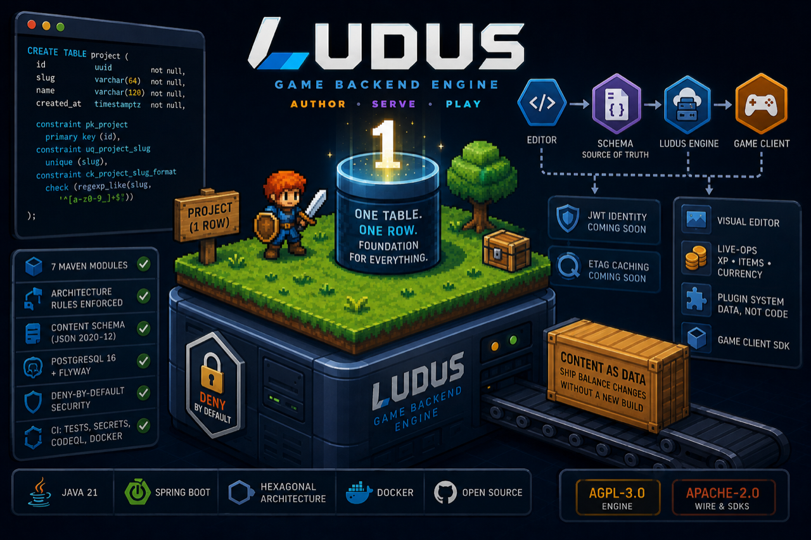

# Getting started

<p align="center">
  
</p>

What follows works today, on `v0.0.1`. Anything not yet built is called out as such. The picture
above is the same claim in one frame: a green tick is something you can run now, and anything
marked *coming soon* is not in the box yet.

## Requirements

Docker, and nothing else. To build from source instead, JDK 21.

## Run it

```bash
git clone https://github.com/MiladNalbandi/ludus-engine.git
cd ludus-engine
cp deploy/.env.example deploy/.env
```

Open `deploy/.env` and change `LUDUS_DB_PASSWORD`. Compose refuses to start without it, on
purpose — a default database password in a public quickstart is a default database password in
production three months later.

```bash
docker compose -f deploy/docker-compose.yml up
```

First run builds the image, which takes a few minutes. After that it is seconds.

## Confirm it works

```bash
curl -s localhost:8080/actuator/health
# {"status":"UP", ...}
```

| | |
|---|---|
| API documentation | <http://localhost:8080/docs> |
| OpenAPI document | <http://localhost:8080/api-docs> |
| Health | <http://localhost:8080/actuator/health> |
| Metrics | <http://localhost:8080/actuator/prometheus> |

Everything else returns `403`, and that is deliberate — see [what you can't do yet](#what-you-cant-do-yet).

```bash
curl -s -o /dev/null -w '%{http_code}\n' localhost:8080/api/v1/anything
# 403
```

## Build and test from source

```bash
./mvnw verify
```

That runs the unit tests, the JSON Schema conformance tests, the architecture rules and the
dependency bans. It takes well under a minute on a warm cache.

To run one module or one test:

```bash
./mvnw -pl engine/engine-domain test
./mvnw -Dtest=SlugTest test
```

## What you can't do yet

The engine has no content API and no authentication. It deliberately **denies every request**
except the operational endpoints and the API documentation, on the grounds that an endpoint added
before authentication exists should be unreachable rather than accidentally public.

- Authentication and API keys arrive in `v0.1.0` — [#7](https://github.com/MiladNalbandi/ludus-engine/issues/7)
- Authoring and serving content arrives in `v0.2.0` — [#8](https://github.com/MiladNalbandi/ludus-engine/issues/8)
- The visual editor arrives in `v0.3.0` — [#9](https://github.com/MiladNalbandi/ludus-engine/issues/9)

What *does* exist and is worth looking at now: the [content contract](../concepts/content-model.md)
in `contracts/schemas/wave/v1.json`, and three worked examples in `samples/waves/` that are
validated against it on every build.

## Troubleshooting

**Compose exits immediately complaining about `LUDUS_DB_PASSWORD`.** You skipped editing
`deploy/.env`. That is the intended behaviour.

**The engine container restarts.** Almost always the database not being ready. Compose waits on a
health check, so this should be rare; if it persists, `docker compose -f deploy/docker-compose.yml logs engine`
will say why.

**`/actuator/prometheus` returns 404 rather than metrics.** Metrics export is opt-in from Spring
Boot 3.5 onwards and is enabled explicitly in `application.yml`. If you have overridden that
configuration, put it back.

**Port 8080 is taken.** Set `LUDUS_PORT` in `deploy/.env`.
